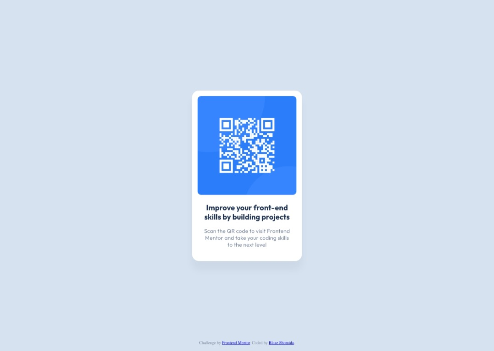
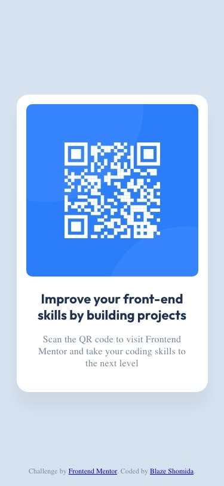
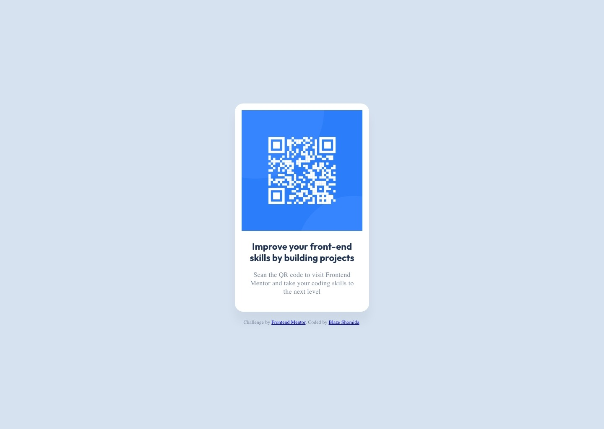

# Frontend Mentor - QR Code Component Solution <!-- omit from toc -->

In this project, I took on the [QR Code Component Challenge](https://www.frontendmentor.io/challenges/qr-code-component-iux_sIO_H) from Frontend Mentor, a platform that enhances coding skills by providing real-world projects. Throughout the process, I've developed a stronger grasp of CSS layouts, specifically with Flexbox and CSS Grid, and got the opportunity to troubleshoot an issue related to CSS border radius. The challenge also allowed me to employ best practices in HTML structure using semantic tags such as `<article>` and `<picture>`. This hands-on experience was complemented with valuable resources that deepened my understanding of CSS reset and the significance of semantic HTML. Moving forward, I plan to continue honing my skills in these areas while exploring new ones such as CSS animations and transitions.

## Table of contents <!-- omit from toc -->

- [Overview](#overview)
  - [Screenshots](#screenshots)
  - [Links](#links)
- [My process](#my-process)
  - [Built with](#built-with)
  - [My approach](#my-approach)
  - [What I learned](#what-i-learned)
  - [Continued development](#continued-development)
  - [Useful resources](#useful-resources)
- [Author](#author)

***

## Overview

### Screenshots

<!-- #### **Design:**

#### **Solution:**

 -->

<section style="display: grid; grid-template-columns: 1fr 1fr; gap: 1rem;">
  <section style="height: 100%">
    <h4 style="font-weight: bold">Design:</h4>
    

    
    
  </section>
  <section style="height: 100%">
    <h4 style="font-weight: bold">Solution:</h4>
    

    
    
  </section>
</section>

 

### Links

- Solution URL: [View Solution HERE](https://www.frontendmentor.io/solutions/qr-code-component-using-flexbox-and-figma-GJgGmLZk3u)
- Live Site URL: [View Live Site HERE](https://blazeshomida.github.io/QR-Code-Component/)

***

## My process

### Built with

- Semantic HTML5 markup
- CSS custom properties
- Flexbox

### My approach

Upon beginning this project, I was provided with the essential materials: the boilerplate for index.html, textual content, necessary assets, style guide, and design files. Identifying key initial steps was my priority.

First, I created a CSS file and made sure it was linked correctly to my HTML document. Knowing the need for specific typography, I proceeded to import the needed fonts from Google Fonts.

Next, I thoroughly reviewed the design files. This helped me understand how to best structure my HTML using semantic markup. This review made it clear that I should use the `<article>` element for the card, which holds stand-alone content. I also realized that I needed to separate two different pieces of content within this card, leading me to create `<picture>` and `<section>` elements. I opted for the `<section>` element over a `
` for better accessibility.

After structuring my HTML, I moved on to creating custom variables for colors and text styles, based on the provided design. I also implemented a CSS reset from [Josh Comeau](https://www.joshwcomeau.com/css/custom-css-reset/) to ensure my styles worked consistently across different browsers. It was during this phase that I encountered an issue with the border radius, which I discuss in more detail [here](#what-i-learned).

With that issue resolved, I continued with the rest of the styling, using the design file as a guide to match as closely as possible. This involved careful adjustments to dimensions, colors, fonts, and spacing. Along the way, I tested my solution in different browsers and screen sizes to ensure a consistent experience. Any additional challenges or interesting decisions I faced are detailed in the ['What I learned'](#what-i-learned) and ['Continued development'](#continued-development) sections.

### What I learned

During this project, I encountered an issue related to applying the border-radius style to an image. Initially, I applied the border-radius to the parent `.card__image` class, but it did not affect the image as expected.

My initial workaround was to add the `.card__image` class directly to the `` tag, which successfully applied the border radius. However, I recognized this approach might introduce unnecessary repetition, particularly if multiple image sources were involved in the future.

To optimize the code, I leveraged CSS selectors to apply the border radius to any img tag within the `.card__image` class by using the `.card__image img` selector. This not only solved the immediate issue but also provided a scalable solution for potential additional image sources, demonstrating an effective use of CSS selectors for maintainability and code efficiency.

### Continued development

In the upcoming period, my primary focus will be on the advancement of my proficiency in CSS layout design, with an emphasis on harnessing the full potential of Flexbox and CSS Grid. My objective is to create layouts that are responsive, efficient, and intuitive. In addition to this, I am intrigued by the dynamic aspects of web design and intend to delve deeper into CSS animations and transitions. My goal is to incorporate these interactive elements seamlessly into my future projects, enhancing user engagement and overall user experience.

### Useful resources

- [Taking on a Frontend Mentor challenge | Responsive Product Preview Card Component](https://youtu.be/B2WL6KkqhLQ) - This video is what I had used to doing research about the frontendmentor.io challenges and also where I learned about the CSS reset and the `<article>` and `<picture>` elements.
- [Modern CSS Reset by Josh Comeau](https://www.joshwcomeau.com/css/custom-css-reset/) - This helped me with reseting the default CSS styles for some elements as well as provides a deeper explanation for what the reset is actually doing.

***

## Author

- Github Profile - [Blaze Shomida](https://github.com/shomidamoney)
- Frontend Mentor - [@shomidamoney](https://www.frontendmentor.io/profile/shomidamoney)
